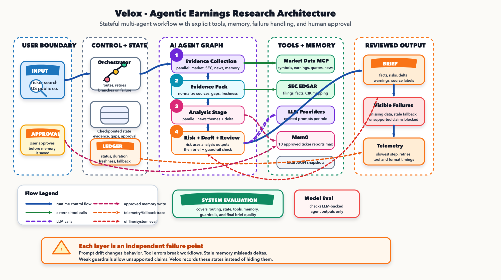
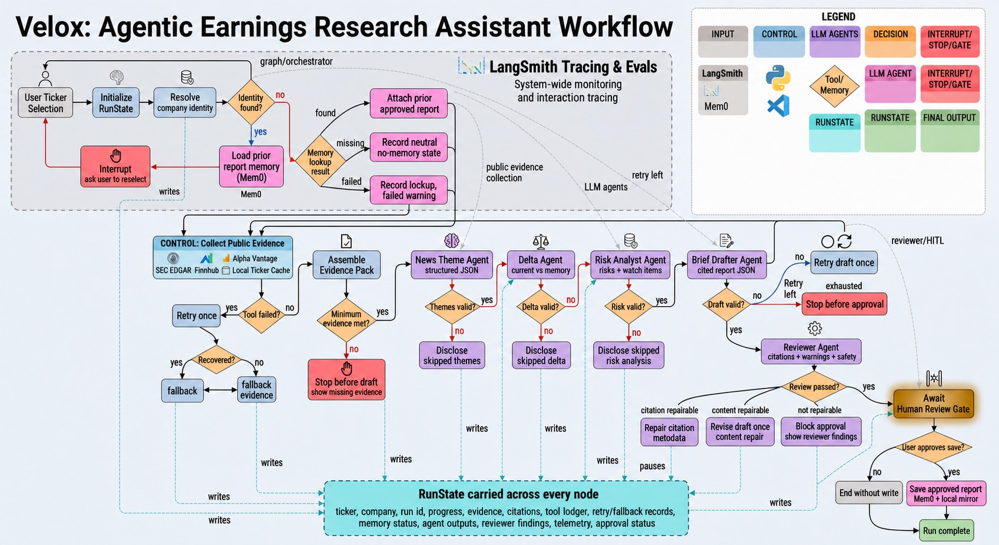

# Velox - Stock Earnings Research Agent

Velox is a Week 3 agentic AI project for generating source-grounded earnings preview briefs for public-company tickers. It is a lean agent orchestration application, not a brokerage, advisor, or trading product.

## What This Repo Contains

| Area | Location | Purpose |
|---|---|---|
| PRD | [docs/PRD.md](docs/PRD.md) | Reviewer-facing primer, framework table, product requirements, safety boundaries, and success criteria. |
| Architecture | [docs/ARCHITECTURE.md](docs/ARCHITECTURE.md) | Technical architecture, graph flow, tool strategy, telemetry, and data presentation. |
| Diagrams | [assets/](assets/) | Final architecture and agentic workflow diagrams. |
| Runtime data | [data/](data/) | Local ticker cache plus ignored approved-report snapshots generated at runtime. |
| App surface | [frontend/](frontend/) | Streamlit app entry point. |
| Agent implementation | [src/](src/) | LangGraph orchestration, tools, memory snapshots, and report generation. |
| Tests | [tests/](tests/) | Focused tests for tool fallbacks, safety boundaries, and report structure. |

## Architecture Diagrams

### System Architecture



### Agentic Workflow



## Current Scope

Velox lets a user search for a U.S. public ticker, gathers public earnings/company/news context, compares against prior project-owned Mem0 memory, and produces a reviewed earnings preview with risk flags, missing-data notes, visible tool usage, and human approval before saving. See [docs/PRD.md](docs/PRD.md) for the reviewer-facing scope.

The application uses public market/company data tools, Mem0 memory, and local JSON snapshot exports. Kubera, brokerage accounts, portfolio connections, bank data, and personal user data are out of scope.

## Local Setup

### Prerequisites

- Python 3.11
- Git
- Provider credentials copied into a local `.env` file

### 1. Clone And Enter The Repo

```bash
git clone git@github.com:vvictor10/velox.git
cd velox
```

If SSH is not configured for your GitHub account, use:

```bash
git clone https://github.com/vvictor10/velox.git
cd velox
```

### 2. Create A Virtual Environment

```bash
python3.11 -m venv .venv
.venv/bin/pip install -r requirements.txt
```

### 3. Configure Environment Variables

```bash
cp .env.example .env
```

Open `.env` and fill in the credentials you have. Do not commit `.env`.

Required for the full agentic workflow:

- `MEM0_API_KEY`
- `SEC_USER_AGENT`
- At least one LLM provider key: `NEBIUS_API_KEY` or `FIREWORKS_API_KEY`
- At least one live market/news provider path. For best coverage, use both:
  - `FINNHUB_API_KEY`
  - `ALPHA_VANTAGE_API_KEY`

Recommended demo settings:

```bash
FINNHUB_LIVE_ENABLED=true
SEC_LIVE_ENABLED=true
ALPHA_VANTAGE_LIVE_ENABLED=true
ALPHA_VANTAGE_MIN_SECONDS_BETWEEN_CALLS=1.1
VELOX_DEMO_FORCE_ALPHA_NEWS_FAILURE=false
```

LangSmith is optional. To enable tracing:

```bash
LANGSMITH_API_KEY=your_key_here
LANGSMITH_TRACING=true
LANGSMITH_PROJECT=velox
```

### 4. Refresh Local Ticker Cache

The repo includes `data/static/company_tickers.json`. If it is missing or stale, refresh it from SEC:

```bash
.venv/bin/python scripts/refresh_tickers.py
```

Ticker typeahead uses this local file and does not call Alpha Vantage or Finnhub per keystroke.

### 5. Run The App

```bash
.venv/bin/streamlit run frontend/app.py
```

Then open the local URL Streamlit prints in the terminal.

### 6. Validate Locally

```bash
.venv/bin/python -m pytest -p no:cacheprovider tests/unit
RUFF_CACHE_DIR=/tmp/velox_ruff_cache .venv/bin/python -m ruff check src/velox scripts tests/unit
```

## Data Directory

The repository intentionally keeps data small and reproducible:

- `data/static/company_tickers.json` is the local SEC-seeded ticker lookup used by the app.
- `data/processed/briefs/` is where approved local report snapshots are written at runtime.
- `data/processed/briefs/*.json` is gitignored because those files are generated user-approved memory artifacts.
- The repo keeps only `.gitkeep` files for empty runtime directories.

Do not commit ad hoc saved report snapshots from `data/processed/briefs/`. If sample reports are needed for review, generate curated sample outputs separately and verify they contain only public, non-secret data.

## Demo Failure Path

To demonstrate visible tool failure and fallback behavior without waiting for a real provider outage, set this optional flag in `.env`:

```bash
VELOX_DEMO_FORCE_ALPHA_NEWS_FAILURE=true
```

With Finnhub enabled, Velox records the forced Alpha Vantage news failure, retries it, falls back to Finnhub company news when available, and surfaces the degraded path in progress, warnings, telemetry, and the tool ledger.
