# Agent Flow: Velox Earnings Research Run

This diagram focuses on the runtime graph from ticker selection to reviewed report production. It intentionally skips provider/storage implementation details so we can reason about agents, state updates, retries, interrupts, and awaits.

```mermaid
flowchart LR
    user[User types in ticker search] --> select[User selects ticker from typeahead]
    select --> init[Initialize RunState]
    init --> resolve[Resolve selected company identity]
    resolve --> resolvable{Still resolvable?}
    resolvable -- no --> badTicker[[Interrupt: ask user to reselect ticker]]
    badTicker --> user
    resolvable -- yes --> supervisor[Supervisor creates research plan]

    supervisor --> fanout[Schedule evidence gathering]
    fanout --> market[Market Data Agent]
    fanout --> filings[Company Filings Agent]
    fanout --> news[News Retrieval Agent]
    fanout --> prior[Prior Report Lookup]

    market --> toolCheck{Tool failure or stale data?}
    filings --> toolCheck
    news --> toolCheck
    prior --> toolCheck

    toolCheck -- yes --> retry[Retry failed tool once]
    retry --> recovered{Recovered?}
    recovered -- no --> gap[Record explicit gap or stale-data warning]
    recovered -- yes --> assemble[Assemble Evidence Pack]
    toolCheck -- no --> assemble
    gap --> assemble

    assemble --> evidenceGate{Minimum evidence met?}
    evidenceGate -- no --> stopWeak[[Interrupt: explain missing evidence and stop]]
    evidenceGate -- yes --> themes[News Theme Agent]
    themes --> themesOk{Themes valid?}
    themesOk -- "no, retry left" --> themesRetry[Retry themes or fallback model]
    themesOk -- "no, exhausted" --> stopAgent[[Interrupt: explain agent failure]]
    themesRetry --> themes
    themesOk -- yes --> delta[Delta Agent]

    delta --> deltaOk{Delta valid?}
    deltaOk -- "no, retry left" --> deltaRetry[Retry delta or fallback model]
    deltaOk -- "no, exhausted" --> stopAgent
    deltaRetry --> delta
    deltaOk -- yes --> risk[Risk Analyst Agent]

    risk --> riskOk{Risks grounded?}
    riskOk -- "no, retry left" --> riskRetry[Retry risk or fallback model]
    riskOk -- "no, exhausted" --> stopAgent
    riskRetry --> risk
    riskOk -- yes --> draft[Brief Drafter Agent]

    draft --> draftOk{Brief schema valid?}
    draftOk -- "no, retry left" --> draftRetry[Retry draft or fallback model]
    draftOk -- "no, exhausted" --> stopAgent
    draftRetry --> draft
    draftOk -- yes --> review[Reviewer Agent]

    review --> reviewGate{Review passed?}
    reviewGate -- no --> revise[Revise draft with reviewer findings]
    revise --> review
    reviewGate -- yes --> report[Reviewed Earnings Brief]

    report --> awaitApproval[[Await: human approves save or export]]
    awaitApproval --> approved{Approved?}
    approved -- no --> endNoSave[End run without write action]
    approved -- yes --> final[Finalize report snapshot]
    final --> done[Run complete]
    endNoSave --> done

    subgraph State["RunState checkpointed between nodes"]
      stateFields["ticker, company identity, research plan, evidence pack, tool ledger, retries, warnings, prior report summary, agent outputs, reviewer findings, telemetry, approval status"]
    end

    init -. creates .-> State
    resolve -. writes .-> State
    market -. writes .-> State
    filings -. writes .-> State
    news -. writes .-> State
    prior -. writes .-> State
    gap -. writes .-> State
    assemble -. writes .-> State
    themes -. writes .-> State
    delta -. writes .-> State
    risk -. writes .-> State
    draft -. writes .-> State
    review -. writes .-> State
    awaitApproval -. pauses .-> State

    classDef input fill:#f7f7f7,stroke:#374151,color:#111827
    classDef control fill:#e0f2fe,stroke:#0369a1,color:#0c4a6e
    classDef agent fill:#fef3c7,stroke:#b45309,color:#78350f
    classDef llm fill:#ede9fe,stroke:#6d28d9,color:#3b0764
    classDef decision fill:#fff7ed,stroke:#ea580c,color:#7c2d12
    classDef interrupt fill:#fee2e2,stroke:#dc2626,color:#7f1d1d
    classDef output fill:#dcfce7,stroke:#16a34a,color:#14532d
    classDef state fill:#ecfeff,stroke:#0891b2,color:#164e63,stroke-dasharray: 5 5

    class user,select input
    class init,resolve,supervisor,fanout,retry,gap,assemble,themesRetry,deltaRetry,riskRetry,draftRetry,revise,final control
    class market,filings,news,prior agent
    class themes,delta,risk,draft,review llm
    class resolvable,toolCheck,recovered,evidenceGate,themesOk,deltaOk,riskOk,draftOk,reviewGate,approved decision
    class badTicker,stopWeak,stopAgent,awaitApproval interrupt
    class report,done,endNoSave output
    class State,stateFields state
```

## Agent Nodes

| Node | Responsibility | LLM? | State written |
|---|---|---:|---|
| Supervisor | Creates plan, routes graph, branches on failures, records progress. | No/optional | `research_plan`, `current_step`, `node_statuses` |
| Resolve selected company identity | Confirms the typeahead selection still maps to a public U.S. ticker before spending tokens. | No | `company_identity`, `validation_status` |
| Market data agent | Fetches earnings timing, quote, basic market context. | No | `earnings_snapshot`, `market_snapshot`, `tool_ledger` |
| Company filings agent | Fetches SEC/company facts and recent filing metadata. | No | `company_context`, `filing_context`, `tool_ledger` |
| News retrieval agent | Fetches recent public headlines. | No | `news_items`, `tool_ledger` |
| Prior report lookup | Loads the last approved report snapshot for this ticker when one exists. | No | `prior_report_summary`, `prior_report_timestamp` |
| Evidence assembler | Normalizes tool outputs into tables and decides whether minimum evidence exists. | No | `evidence_pack`, `warnings` |
| News theme agent | Groups headlines into earnings-relevant themes such as demand, guidance, margin pressure, regulation, product cycle, competition, or management commentary. | Yes | `news_themes` |
| Delta agent | Compares current findings to prior approved report when available. | Yes | `delta_findings`, `stale_memory_notes` |
| Risk analyst agent | Produces risk register, watch items, bull/bear considerations from evidence only. | Yes | `risk_register`, `watch_items` |
| Brief drafter agent | Creates the structured earnings preview brief. | Yes | `draft_brief` |
| Reviewer agent | Checks the draft against the evidence pack, tool ledger, stale-data warnings, required brief schema, and no-investment-advice policy. | Yes/checklist | `reviewer_findings`, `review_status` |

## Interrupts And Awaits

| Point | Type | Why it exists |
|---|---|---|
| Unresolvable ticker selection | Interrupt | Typeahead prevents most invalid tickers, but this catches stale dropdown results or provider mismatches. |
| Tool failure after retry | Branch | Continue with explicit missing-data or stale-data warning instead of silent fallback. |
| Minimum evidence missing | Interrupt | Stop before drafting if the report would be too weak to be useful or grounded. |
| Agent output failure | Branch | Retry the same agent or fallback model when JSON/schema/grounding checks fail. |
| Reviewer failed | Loop | Send reviewer findings back to the drafter once before presenting the report. |
| Human approval | Await | The agent can research and draft autonomously, but final save/export requires user approval. |

## LLM Selection Note

During testing, each LLM-backed node should be pinned to one specific model and prompt version. The router can still support multiple providers, but the submitted/demo configuration should be fixed so results are reproducible.

Recommended prompt files:

- `src/velox/prompts/news_theme_classifier.md`
- `src/velox/prompts/delta_analyst.md`
- `src/velox/prompts/risk_analyst.md`
- `src/velox/prompts/brief_drafter.md`
- `src/velox/prompts/reviewer.md`
